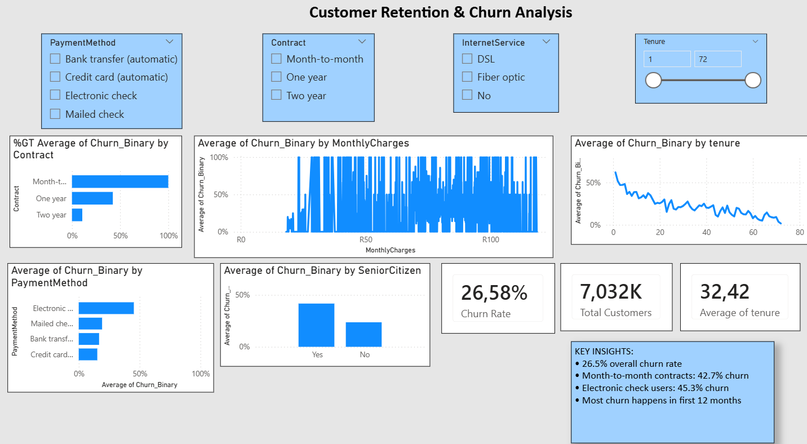

# 📊 Task 2: Customer Retention & Churn Analysis

**Intern:** Noliyolo Mamello Khotseng  
**CIN ID:** FIT/APR26/DS16358  

---

## 📌 Overview

This project analyzes telecom customer churn using **Python** and **Power BI** to identify why customers leave and provide actionable retention strategies.

---

## 🔧 Tools Used

- **Python (Pandas, Matplotlib, Seaborn)** – Data cleaning & analysis  
- **Power BI** – Interactive dashboards  
- **HTML/CSS/JavaScript** – Web dashboard  
- **Git/GitHub** – Version control  

---
## 📸 Dashboard Preview

  

----

## 📈 Key Insights

- **Churn Rate:** ~26.5%  
- **Highest Risk:** Month-to-month (42.7%)  
- **Payment Risk:** Electronic check (45.3%)  
- **Critical Period:** First 12 months  
- **Trend:** Higher charges → higher churn  

**Note:** Python (7,043 customers) vs Power BI (7,032) differs due to data filtering, but insights remain consistent.

---

## 🔍 Main Churn Drivers

- **Contract Type:** Month-to-month ↑ churn  
- **Payment Method:** Electronic check ↑ churn  
- **Tenure:** Early-stage customers ↑ churn  
- **Internet Service:** Fiber optic ↑ churn  
- **Monthly Charges:** Higher cost ↑ churn  

---

## 💡 Recommendations

- Promote **long-term contracts**  
- Encourage **auto-pay adoption**  
- Improve **first-year onboarding**  
- Review **fiber pricing strategies**  
- Introduce **loyalty incentives**  

---

## 📁 Key Files

- `task2_churn_analysis.py` – Python analysis  
- `churn_dashboard.html` – Web dashboard  
- `Task2_Churn_Dashboard.pbix` – Power BI dashboard  
- `Telco_Customer_Churn_CLEANED.csv` – Dataset  

---

